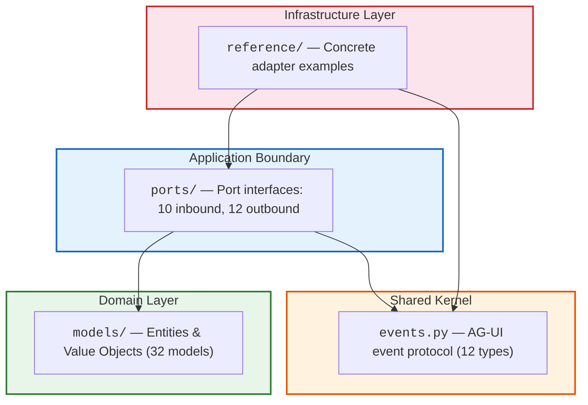

# This repository was edited from the Capillary Actions SDK.

## Capillary Actions SDK

Extension SDK for the Capillary Actions platform. Provides port interfaces, data models, and AG-UI event types for building adapters and services that integrate with the platform's hexagonal architecture.

**Status:** Development (0.2.0)

**Requires:** Python >= 3.13, Pydantic >= 2.0

## Architecture

The SDK is a **contract library** following [Explicit Architecture](https://herbertograca.com/2017/11/16/explicit-architecture-01-ddd-hexagonal-onion-clean-cqrs-how-i-put-it-all-together/) (Hexagonal + Clean Architecture + DDD). It defines the domain models, port interfaces, and shared event protocol that the platform and its extensions agree on — with zero dependencies beyond Pydantic.



Dependencies point **inward** — the domain depends on nothing; infrastructure depends on everything. See [Architecture Overview](docs/architecture.md) for the full picture.

## Extension Domains

| Track | Domain              | Focus                                               | Main Extension Point                                        |
| ----- | ------------------- | --------------------------------------------------- | ----------------------------------------------------------- |
| 1     | Student Model       | Cohort-based preference aggregation, learner memory | `CohortStrategyPort`                                        |
| 2a    | Learning Actions    | Triggers, orchestration DAGs, agent loops           | `TriggerSchedulerPort`                                      |
| 2b    | Learner Interaction | Knowledge graphs, learner progress, teaching        | `KnowledgeGraphPort`, `LearnerProgressPort`, `TeachingPort` |
| 3     | Presentation        | Multi-channel messaging, sessions, HITL gates       | `ChannelAdapterPort`                                        |

## Getting Started

### 1. Install

```bash
# Clone and install in development mode
git clone https://github.com/Allogy/capillary-actions-sdk.git
cd capillary-actions-sdk
uv venv && uv sync --all-groups
```

Or install directly:

```bash
uv pip install git+https://github.com/Allogy/capillary-actions-sdk.git
```

### 2. Verify installation

```bash
uv run python -c "
from capillary_actions_sdk.events import AGUIEvent, AGUIEventType
from capillary_actions_sdk.ports.presentation import ChannelAdapterPort
from capillary_actions_sdk.ports.student_model import CohortStrategyPort
from capillary_actions_sdk.models.student_model import PreferenceSignal
from capillary_actions_sdk.models.learning_actions import TriggerDefinition
from capillary_actions_sdk.models.presentation import ChannelSession
print(f'capillary_actions_sdk loaded — {len(AGUIEventType)} event types')
"
```

### 3. Run tests

```bash
uv run pytest tests/ -v
```

### 4. Implement a port

Every extension starts by subclassing a port ABC. Here is an example — a Telegram channel adapter:

```python
from capillary_actions_sdk.events import AGUIEvent, AGUIEventType
from capillary_actions_sdk.models.presentation import (
    ChannelFile,
    ChannelMessage,
    ChannelSession,
    HitlGateConfig,
)
from capillary_actions_sdk.ports.presentation import ChannelAdapterPort


class TelegramAdapter(ChannelAdapterPort):
    @property
    def channel_type(self) -> str:
        return 'telegram'

    async def send_event(self, event: AGUIEvent, session: ChannelSession) -> None:
        if event.event_type == AGUIEventType.TEXT_MESSAGE_END:
            # Buffer tokens during TEXT_MESSAGE_CONTENT, send on END
            await self._send_telegram_message(session, self._flush_buffer(session))

    async def send_error(self, error: str, session: ChannelSession) -> None:
        await self._send_telegram_message(session, f'Error: {error}')

    async def render_hitl_gate(
        self, gate_type: str, gate_config: HitlGateConfig, session: ChannelSession
    ) -> None:
        # Render as Telegram inline keyboard
        ...

    async def receive_message(self, raw_payload: dict) -> ChannelMessage:
        # Parse Telegram update object
        ...

    async def receive_file(self, raw_payload: dict) -> ChannelFile | None:
        ...

    async def resolve_session(self, raw_payload: dict) -> ChannelSession:
        ...

    async def register_webhook(self, callback_url: str) -> None:
        # Call Telegram setWebhook API
        ...

    async def health_check(self) -> bool:
        ...
```

For more examples (cohort strategies, trigger schedulers), see [Reference Adapters](docs/reference-adapters.md).

### 5. Test your adapter

```python
import pytest
from capillary_actions_sdk.ports.presentation import ChannelAdapterPort


class TestMyAdapter:
    def test_implements_port(self):
        adapter = TelegramAdapter(bot_token='test')
        assert isinstance(adapter, ChannelAdapterPort)

    @pytest.mark.asyncio
    async def test_send_event_buffers_tokens(self):
        adapter = TelegramAdapter(bot_token='test')
        session = make_test_session()
        await adapter.send_event(text_message_start_event(), session)
        await adapter.send_event(text_message_content_event('Hello'), session)
        await adapter.send_event(text_message_end_event(), session)
        assert adapter.last_sent_text == 'Hello'
```

See `tests/test_reference_slack.py` for a full example testing the reference Slack adapter.

## Documentation

Detailed architecture documentation, organized by layer:

| Document                                         | Covers                                                                 |
| ------------------------------------------------ | ---------------------------------------------------------------------- |
| [Architecture Overview](docs/architecture.md)    | Big picture: concentric layers, dependency rule, port taxonomy         |
| [Domain Models](docs/domain-models.md)           | `models/` — entity/value object classification, the four tracks        |
| [Ports](docs/ports.md)                           | `ports/` — inbound/outbound catalog, extension points, method patterns |
| [Events](docs/events.md)                         | `events.py` — AG-UI Shared Kernel, event taxonomy, lifecycle sequence  |
| [Reference Adapters](docs/reference-adapters.md) | `reference/` — SlackChannelAdapter dissected, building your own        |
| [Contributing](docs/contributing.md)             | Dependency rule, checklists, testing patterns, code standards          |

## Contributing

### Prerequisites

- Python 3.13+
- [uv](https://docs.astral.sh/uv/) for dependency management
- Familiarity with Python ABCs and Pydantic v2

### Quick Start

```bash
git clone https://github.com/Allogy/capillary-actions-sdk.git
cd capillary-actions-sdk
uv venv && uv sync --all-groups
uv run pytest tests/ -v          # verify baseline
uv run ruff check src/ tests/    # lint
uv run ruff format src/ tests/   # format
```

See [Contributing Guide](docs/contributing.md) for the full development workflow, architectural guardrails, and checklists.

## License

[MIT](LICENSE)
